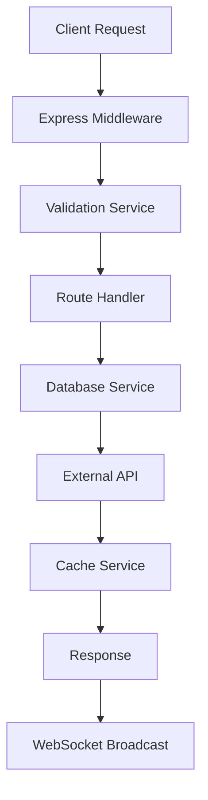

# Technical Documentation

This document provides detailed technical information about PlexComplete's architecture, APIs, and implementation details.

## Table of Contents

- [Architecture Overview](#architecture-overview)
- [Backend Architecture](#backend-architecture)
- [Frontend Architecture](#frontend-architecture)
- [Database Integration](#database-integration)
- [API Integration](#api-integration)
- [Caching System](#caching-system)
- [WebSocket Communication](#websocket-communication)
- [Security Implementation](#security-implementation)
- [Performance Optimization](#performance-optimization)
- [Deployment](#deployment)
- [Development](#development)

## Architecture Overview

PlexComplete follows a modern client-server architecture with real-time communication capabilities.

```
┌─────────────────┐    ┌─────────────────┐    ┌─────────────────┐
│   Web Browser   │    │   Node.js/Bun   │    │   Plex Server   │
│    (Client)     │◄──►│     Server      │◄──►│    Database     │
│                 │    │                 │    │                 │
└─────────────────┘    └─────────────────┘    └─────────────────┘
         │                       │                       
         │              ┌─────────────────┐             
         └─────────────►│  External APIs  │             
                        │  (TMDb,TheTVDB) │             
                        └─────────────────┘             
```

### Technology Stack

**Backend:**
- **Runtime**: Node.js 16+ or Bun 1.0+
- **Framework**: Express.js
- **Database**: SQLite3 (read-only)
- **WebSocket**: ws library
- **Caching**: File-based + Memory

**Frontend:**
- **Framework**: Vanilla JavaScript (ES6+)
- **Styling**: Tailwind CSS 3.x
- **Icons**: Heroicons SVG
- **Build**: No bundler (native ES modules)

## Backend Architecture

### Server Structure

```
server-crossplatform.js
├── Express.js application setup
├── Security middleware
├── API route handlers
├── WebSocket server
├── Database services
└── Cache management
```

### Core Services

#### DatabaseService (`services/DatabaseService.js`)
- Secure database operations
- Temporary file management
- Read-only access enforcement
- Cross-platform path resolution

#### ValidationService (`services/ValidationService.js`)
- Input sanitization
- SQL injection prevention
- Parameter validation
- XSS protection

#### CacheService (`services/CacheService.js`)
- LRU cache implementation
- File-based persistence
- TTL (Time To Live) management
- Memory optimization

### API Endpoints

#### Series Management
```javascript
POST /api/get-series          // Load TV series from Plex
POST /api/analyze-series      // Analyze single series
POST /api/save-analysis       // Save analysis results
GET  /api/load-cache          // Load cached analyses
POST /api/rebuild-cache       // Rebuild cache files
POST /api/cleanup-database    // Database maintenance
```

#### Configuration
```javascript
GET  /api/settings            // Get current configuration
POST /api/settings            // Update configuration
GET  /api/test-apis           // Test API connectivity
GET  /api/find-plex-database  // Auto-detect Plex DB path
```

#### Monitoring
```javascript
GET  /api/monitoring/report     // System statistics
GET  /api/monitoring/dashboard  // Performance metrics
POST /api/monitoring/reset      // Reset counters
GET  /api/websocket/status      // WebSocket status
```

### Request/Response Flow



## Frontend Architecture

### Module Structure

```
public/js/
├── app.js                 # Main application logic
├── button-fix.js         # Event handling system
├── init-settings.js      # Settings initialization
├── statistics-manager.js # Analytics and charts
├── export-manager.js     # Multi-format exports
├── advanced-search.js    # Search functionality
├── websocket-client.js   # Real-time communication
├── retry-manager.js      # API retry logic
└── api-retry-wrapper.js  # Request wrapper
```

### State Management

PlexComplete uses a global state object for client-side state management:

```javascript
window.state = {
    series: [],           // All loaded series
    filteredSeries: [],   // Currently displayed series
    currentPage: 1,       // Pagination state
    itemsPerPage: 80,     // Items per page
    isAnalyzing: false,   // Analysis state
    stopAnalysis: false,  // Analysis control
    searchTerm: '',       // Search query
    activeFilter: 'all', // Active filter
    sortBy: 'name-asc'   // Sorting option
};
```

### Event System

The application uses a custom event delegation system:

```javascript
// button-fix.js handles all button interactions
document.addEventListener('click', function(e) {
    const target = e.target.closest('[data-action]');
    if (!target) return;
    
    const action = target.dataset.action;
    executeAction(action, target, e);
});
```

### Component Architecture

#### Series Cards
```javascript
function createSeriesCard(series) {
    return {
        id: series.id,
        title: series.title,
        completionPercentage: calculateCompletion(series),
        missingEpisodes: findMissingEpisodes(series),
        metadata: enrichMetadata(series)
    };
}
```

#### Search & Filtering
```javascript
const searchSystem = {
    filters: new Map(),
    sorters: new Map(),
    
    addFilter(name, predicate) {
        this.filters.set(name, predicate);
    },
    
    applyFilters(series) {
        return series.filter(s => 
            Array.from(this.filters.values())
                .every(filter => filter(s))
        );
    }
};
```

## Database Integration

### Plex Database Schema

PlexComplete interacts with the following Plex database tables:

```sql
-- Main metadata table
metadata_items (
    id INTEGER,
    title VARCHAR,
    year INTEGER,
    studio VARCHAR,
    content_rating VARCHAR,
    ...
)

-- Season information
metadata_items (seasons) (
    parent_id INTEGER,  -- References show ID
    title VARCHAR,      -- Season name
    index INTEGER       -- Season number
)

-- Episode information  
metadata_items (episodes) (
    parent_id INTEGER,  -- References season ID
    title VARCHAR,      -- Episode title
    index INTEGER,      -- Episode number
    ...
)

-- File locations
media_parts (
    id INTEGER,
    file VARCHAR        -- Full file path
)
```

### Data Processing Pipeline

```javascript
async function loadPlexSeries() {
    // 1. Create temporary database copy
    const tempDbPath = await createTempDatabase();
    
    // 2. Execute safe SQL queries
    const series = await querySeriesData(tempDbPath);
    
    // 3. Enrich with metadata
    const enriched = await enrichSeriesMetadata(series);
    
    // 4. Clean up temporary files
    await cleanupTempDatabase(tempDbPath);
    
    return enriched;
}
```

### Security Measures

- **Read-only access**: Database is copied before access
- **Parameterized queries**: No SQL injection vulnerabilities  
- **Temporary files**: Cleaned up after use
- **Path validation**: All paths sanitized and validated

## API Integration

### External APIs

#### TMDb (The Movie Database)
```javascript
const tmdbApi = {
    baseUrl: 'https://api.themoviedb.org/3',
    endpoints: {
        search: '/search/tv',
        series: '/tv/{id}',
        season: '/tv/{id}/season/{season}'
    },
    
    async searchSeries(title, year) {
        const params = new URLSearchParams({
            api_key: this.apiKey,
            query: title,
            first_air_date_year: year
        });
        
        return fetch(`${this.baseUrl}/search/tv?${params}`);
    }
};
```

#### TheTVDB
```javascript
const thetvdbApi = {
    baseUrl: 'https://api4.thetvdb.com/v4',
    
    async authenticate() {
        const response = await fetch(`${this.baseUrl}/login`, {
            method: 'POST',
            headers: { 'Content-Type': 'application/json' },
            body: JSON.stringify({ apikey: this.apiKey })
        });
        
        const { data } = await response.json();
        this.token = data.token;
    },
    
    async searchSeries(title) {
        return fetch(`${this.baseUrl}/search`, {
            headers: { 'Authorization': `Bearer ${this.token}` }
        });
    }
};
```

### Rate Limiting

```javascript
class RateLimiter {
    constructor(maxConcurrent = 3, delayMs = 100) {
        this.maxConcurrent = maxConcurrent;
        this.delayMs = delayMs;
        this.queue = [];
        this.active = 0;
    }
    
    async execute(fn) {
        return new Promise((resolve, reject) => {
            this.queue.push({ fn, resolve, reject });
            this.processQueue();
        });
    }
    
    async processQueue() {
        if (this.active >= this.maxConcurrent || this.queue.length === 0) {
            return;
        }
        
        const { fn, resolve, reject } = this.queue.shift();
        this.active++;
        
        try {
            const result = await fn();
            resolve(result);
        } catch (error) {
            reject(error);
        } finally {
            this.active--;
            setTimeout(() => this.processQueue(), this.delayMs);
        }
    }
}
```

## Caching System

### Multi-Layer Caching

```
┌─────────────────┐
│ Browser Storage │ (24 hours)
└─────────────────┘
          │
┌─────────────────┐
│  Memory Cache   │ (Runtime)
└─────────────────┘
          │
┌─────────────────┐
│   File Cache    │ (7 days)
└─────────────────┘
```

### Cache Implementation

#### Browser Storage
```javascript
const cacheManager = {
    set(key, data, ttl = 24 * 60 * 60 * 1000) {
        const item = {
            data,
            timestamp: Date.now(),
            ttl
        };
        localStorage.setItem(key, JSON.stringify(item));
    },
    
    get(key) {
        const item = JSON.parse(localStorage.getItem(key));
        if (!item) return null;
        
        if (Date.now() - item.timestamp > item.ttl) {
            localStorage.removeItem(key);
            return null;
        }
        
        return item.data;
    }
};
```

#### File-based Cache
```javascript
class FileCache {
    constructor(cacheDir, defaultTtl) {
        this.cacheDir = cacheDir;
        this.defaultTtl = defaultTtl;
    }
    
    getCacheKey(url, params) {
        const key = `${url}_${JSON.stringify(params)}`;
        return crypto.createHash('md5').update(key).digest('hex');
    }
    
    async get(key) {
        const filePath = path.join(this.cacheDir, `${key}.json`);
        
        try {
            const stats = await fs.stat(filePath);
            if (Date.now() - stats.mtime.getTime() > this.defaultTtl) {
                await fs.unlink(filePath);
                return null;
            }
            
            const data = await fs.readFile(filePath, 'utf8');
            return JSON.parse(data);
        } catch {
            return null;
        }
    }
    
    async set(key, data) {
        const filePath = path.join(this.cacheDir, `${key}.json`);
        await fs.writeFile(filePath, JSON.stringify(data));
    }
}
```

## WebSocket Communication

### Real-time Features

```javascript
class WebSocketManager {
    constructor(url) {
        this.url = url;
        this.reconnectAttempts = 0;
        this.maxReconnectAttempts = 5;
        this.reconnectDelay = 1000;
        this.handlers = new Map();
    }
    
    connect() {
        this.ws = new WebSocket(this.url);
        
        this.ws.onopen = () => {
            console.log('WebSocket connected');
            this.reconnectAttempts = 0;
            this.emit('connected');
        };
        
        this.ws.onmessage = (event) => {
            const message = JSON.parse(event.data);
            this.handleMessage(message);
        };
        
        this.ws.onclose = () => {
            console.log('WebSocket disconnected');
            this.attemptReconnect();
        };
    }
    
    handleMessage({ type, data }) {
        const handlers = this.handlers.get(type) || [];
        handlers.forEach(handler => handler(data));
    }
    
    on(type, handler) {
        if (!this.handlers.has(type)) {
            this.handlers.set(type, []);
        }
        this.handlers.get(type).push(handler);
    }
    
    send(type, data) {
        if (this.ws.readyState === WebSocket.OPEN) {
            this.ws.send(JSON.stringify({ type, data }));
        }
    }
}
```

### Message Types

```javascript
// Analysis progress
{
    type: 'analysis-progress',
    data: {
        seriesId: 123,
        progress: 0.5,
        status: 'analyzing'
    }
}

// Analysis complete
{
    type: 'analysis-complete',
    data: {
        seriesId: 123,
        result: { ... },
        success: true
    }
}

// System notifications
{
    type: 'notification',
    data: {
        level: 'info|warning|error',
        message: 'Analysis completed',
        timeout: 5000
    }
}
```

## Security Implementation

### Input Validation

```javascript
const ValidationService = {
    validateSeriesId(id) {
        if (!Number.isInteger(id) || id <= 0) {
            throw new Error('Invalid series ID');
        }
        return id;
    },
    
    sanitizePath(filePath) {
        // Remove path traversal attempts
        const sanitized = path.normalize(filePath)
            .replace(/^(\.\.[\/\\])+/, '');
        
        if (sanitized.includes('..')) {
            throw new Error('Invalid file path');
        }
        
        return sanitized;
    },
    
    validateApiKey(key) {
        if (typeof key !== 'string' || key.length < 10) {
            throw new Error('Invalid API key format');
        }
        return key;
    }
};
```

### SQL Security

```javascript
const DatabaseService = {
    async executeSafeQuery(query, params = []) {
        // Use parameterized queries only
        return this.db.all(query, params);
    },
    
    async getSeriesById(id) {
        const query = `
            SELECT * FROM metadata_items 
            WHERE id = ? AND metadata_type = 2
        `;
        return this.executeSafeQuery(query, [id]);
    }
};
```

### XSS Prevention

```javascript
function sanitizeHtml(html) {
    const div = document.createElement('div');
    div.textContent = html;
    return div.innerHTML;
}

function createSeriesCard(series) {
    return `
        <div class="series-card">
            <h3>${sanitizeHtml(series.title)}</h3>
            <p>${sanitizeHtml(series.description)}</p>
        </div>
    `;
}
```

## Performance Optimization

### Database Optimization

```javascript
// Efficient series loading with joins
const optimizedQuery = `
    SELECT 
        s.id,
        s.title,
        s.year,
        COUNT(DISTINCT seasons.id) as season_count,
        COUNT(episodes.id) as episode_count
    FROM metadata_items s
    LEFT JOIN metadata_items seasons ON seasons.parent_id = s.id 
        AND seasons.metadata_type = 3
    LEFT JOIN metadata_items episodes ON episodes.parent_id = seasons.id 
        AND episodes.metadata_type = 4
    WHERE s.metadata_type = 2
    GROUP BY s.id, s.title, s.year
    ORDER BY s.title COLLATE NOCASE
`;
```

### Memory Management

```javascript
class MemoryManager {
    constructor(maxSeries = 1000) {
        this.maxSeries = maxSeries;
        this.seriesCache = new Map();
    }
    
    addSeries(series) {
        if (this.seriesCache.size >= this.maxSeries) {
            // Remove oldest entries
            const firstKey = this.seriesCache.keys().next().value;
            this.seriesCache.delete(firstKey);
        }
        
        this.seriesCache.set(series.id, series);
    }
    
    cleanup() {
        // Periodic cleanup of unused data
        const cutoff = Date.now() - (24 * 60 * 60 * 1000);
        
        for (const [id, series] of this.seriesCache) {
            if (series.lastAccessed < cutoff) {
                this.seriesCache.delete(id);
            }
        }
    }
}
```

### Rendering Optimization

```javascript
// Virtual scrolling for large lists
class VirtualScrolling {
    constructor(container, itemHeight, renderItem) {
        this.container = container;
        this.itemHeight = itemHeight;
        this.renderItem = renderItem;
        this.visibleItems = Math.ceil(container.clientHeight / itemHeight) + 2;
    }
    
    render(items, scrollTop) {
        const startIndex = Math.floor(scrollTop / this.itemHeight);
        const endIndex = Math.min(startIndex + this.visibleItems, items.length);
        
        const visibleItems = items.slice(startIndex, endIndex);
        const html = visibleItems.map(this.renderItem).join('');
        
        this.container.innerHTML = html;
        this.container.style.paddingTop = `${startIndex * this.itemHeight}px`;
    }
}
```

## Deployment

### Production Configuration

```javascript
// ecosystem.config.js - PM2 Configuration
module.exports = {
    apps: [{
        name: 'plexcomplete',
        script: 'server-crossplatform.js',
        instances: 1,
        exec_mode: 'fork',
        env: {
            NODE_ENV: 'production',
            PORT: 3000
        },
        error_file: './logs/err.log',
        out_file: './logs/out.log',
        log_file: './logs/combined.log',
        time: true
    }]
};
```

### Docker Deployment

```dockerfile
FROM node:18-alpine

WORKDIR /app

# Copy package files
COPY package*.json ./
COPY bun.lockb ./

# Install dependencies
RUN npm install --production

# Copy application code
COPY . .

# Create non-root user
RUN addgroup -g 1001 -S plexuser && \
    adduser -S plexuser -u 1001

# Set permissions
RUN chown -R plexuser:plexuser /app
USER plexuser

# Expose port
EXPOSE 3000

# Health check
HEALTHCHECK --interval=30s --timeout=3s --start-period=5s --retries=3 \
    CMD curl -f http://localhost:3000/api/test-connection || exit 1

# Start application
CMD ["node", "server-crossplatform.js"]
```

### Nginx Reverse Proxy

```nginx
server {
    listen 80;
    server_name plexcomplete.yourdomain.com;
    
    location / {
        proxy_pass http://localhost:3000;
        proxy_http_version 1.1;
        proxy_set_header Upgrade $http_upgrade;
        proxy_set_header Connection 'upgrade';
        proxy_set_header Host $host;
        proxy_set_header X-Real-IP $remote_addr;
        proxy_set_header X-Forwarded-For $proxy_add_x_forwarded_for;
        proxy_set_header X-Forwarded-Proto $scheme;
        proxy_cache_bypass $http_upgrade;
    }
    
    # WebSocket support
    location /ws {
        proxy_pass http://localhost:3000;
        proxy_http_version 1.1;
        proxy_set_header Upgrade $http_upgrade;
        proxy_set_header Connection "upgrade";
    }
}
```

## Development

### Development Workflow

```bash
# Start development server with hot reload
bun run dev

# Run linting
bun run lint

# Run tests
bun run test

# Build production assets
bun run build

# Analyze bundle size
bun run analyze
```

### Code Style

```javascript
// ESLint configuration
module.exports = {
    extends: ['eslint:recommended'],
    env: {
        browser: true,
        node: true,
        es2022: true
    },
    parserOptions: {
        ecmaVersion: 'latest',
        sourceType: 'module'
    },
    rules: {
        'no-console': 'warn',
        'no-unused-vars': 'error',
        'prefer-const': 'error',
        'no-var': 'error'
    }
};
```

### Testing Strategy

```javascript
// Example unit test
describe('SeriesAnalyzer', () => {
    test('calculates completion percentage correctly', () => {
        const series = {
            totalEpisodes: 100,
            availableEpisodes: 75
        };
        
        const result = calculateCompletionPercentage(series);
        expect(result).toBe(75);
    });
    
    test('identifies missing episodes', () => {
        const series = createTestSeries();
        const missing = findMissingEpisodes(series);
        
        expect(missing).toHaveLength(3);
        expect(missing[0]).toEqual({
            season: 1,
            episode: 5,
            title: 'Missing Episode'
        });
    });
});
```

### Debug Configuration

```javascript
// Debug logging
const debug = {
    database: require('debug')('plexcomplete:database'),
    api: require('debug')('plexcomplete:api'),
    cache: require('debug')('plexcomplete:cache'),
    websocket: require('debug')('plexcomplete:websocket')
};

// Usage
debug.database('Loading series from database');
debug.api('Making API request to TMDb');
```

---

This technical documentation provides a comprehensive overview of PlexComplete's architecture and implementation. For specific implementation details, refer to the source code and inline documentation.